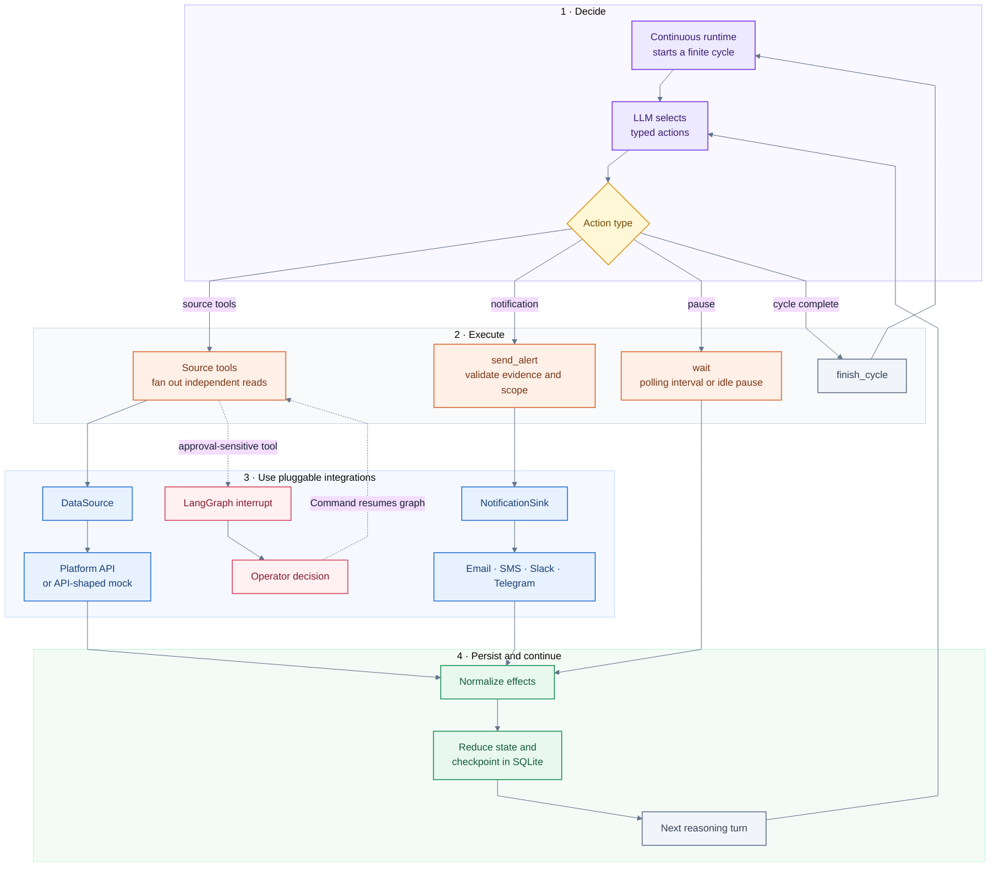

# EventPilot

EventPilot is a generic autonomous operations agent for events and long-running work. It discovers
what is happening, chooses typed tools, decides when to check again, takes source-defined actions,
and sends useful updates through a configured notification channel. Its continuous runtime polls
through source tools on its own schedule and starts fresh reasoning cycles as work evolves.

A `DataSource` defines its domain by registering typed tools and translating their responses into
generic resource observations. Here, a resource means the thing being followed. It could be an
experiment, workflow run, job, incident, deployment, or another source-owned object. Source tools
can inspect or change it. They might read a result, restart a failed workflow, cancel a job, submit
follow-up work, or update an incident.

This repository demonstrates that architecture against
[Adaptyv Foundry](https://foundry.adaptyvbio.com/). Foundry access is mocked. Its adapter models the
operations and response shapes described by Adaptyv's published API, while fixture timing and
lifecycle data stay hidden behind the adapter.

## What it does

- Discovers resources through the typed tools supplied by the configured data source.
- Inspects independent resources concurrently and reduces the resulting evidence in a stable order.
- Chooses whether to investigate, change source state, notify an operator, or finish a cycle.
- Selects its own polling interval and enters a longer idle pause when no active work remains.
- Suspends approval-sensitive tools for an operator decision before resuming the same graph thread.
- Delivers updates through a replaceable notification sink and records successful delivery.
- Persists observations, polling state, approvals, and deduplication data in SQLite checkpoints.

Instructor builds the response schema at runtime from the core actions and the data source's
Pydantic tool models. Each model response is validated against that schema. LangGraph handles
routing and SQLite checkpoints. It suspends approval-sensitive actions with `interrupt()` and
resumes them with `Command`. Reducers own objectives, polling, evidence, delivery state, and cycle
transitions. Platform details live behind the `DataSource` protocol. Delivery uses a separate
`NotificationSink` protocol, so any source can be paired with any sink.

A finite cycle is one bounded reasoning session inside the continuous runtime. `finish_cycle` closes
that session after its current work is complete. The runtime then starts another session on the same
durable supervisor thread.

## Agent loop



Every completed tool path joins at one reducer before the next reasoning turn. Independent source
reads run as LangGraph `Send` branches and join in selection order. Approval-sensitive tools suspend
at `interrupt()` and resume from the same checkpoint with `Command`. `finish_cycle` closes the
finite cycle, then the continuous runtime starts a fresh one.

## Notification sinks

Notification sinks are pluggable delivery integrations. They let a deployment choose where updates
are sent while keeping the monitored platform independent from the messaging provider. The same data
source can be paired with Telegram, SMS, email, Slack, an incident-management system, or an internal
service.

Every sink implements `NotificationSink.send()`, which accepts a destination and a provider-neutral
`Notification` containing a title, body, and priority. It returns a `DeliveryResult` with its channel
and provider message ID so delivery can be recorded durably.

The included `ConsoleNotificationSink` provides local delivery out of the box. Production
deployments can implement the same small protocol for other providers. A sink could send through
any of these channels.

- Telegram through the Bot API.
- SMS through Twilio or another carrier gateway.
- Email or Slack using their native message formats.
- Internal services that open incidents, publish to queues, or call an operator platform.

When the agent finds an event worth reporting, it creates the notification from the available
evidence and sends it through the configured sink. Provider credentials and destinations remain
outside the LLM's tool arguments.

## Human approval

A data source can mark any consequential tool as approval-sensitive. The graph first delivers a
request through the configured notification sink and checkpoints the pending action. Its next node
calls LangGraph `interrupt()` with the action, resources, rationale, and delivery receipt.

An operator response resumes the same supervisor thread with `Command(resume=...)`. Approval routes
to the original source tool. Rejection records a rejected tool result and returns control to the
agent. The SQLite checkpoint preserves the interruption across process restarts. The completed
delivery node prevents another approval message from being sent when the graph resumes.

## Adaptyv API mock

The demo uses a fixture-backed `MockFoundryClient` in place of a Foundry account. It implements the
same `FoundryClient` protocol consumed by `AdaptyvDataSource` and returns Pydantic models shaped
around the official API. The mock covers these documented endpoints.

- [List experiments](https://docs.adaptyvbio.com/api-reference/experiments/list-experiments)
- [Get an experiment](https://docs.adaptyvbio.com/api-reference/experiments/get-experiment)
- [List experiment updates](https://docs.adaptyvbio.com/api-reference/experiments/list-experiment-updates)
- [List results for an experiment](https://docs.adaptyvbio.com/api-reference/experiments/list-results-for-an-experiment)
- [Update an experiment](https://docs.adaptyvbio.com/api-reference/experiments/update-experiment)
- [Submit an experiment](https://docs.adaptyvbio.com/api-reference/experiments/submit-experiment)
- [Get an experiment quote](https://docs.adaptyvbio.com/api-reference/experiments/get-experiment-quote)
- [Accept an experiment quote](https://docs.adaptyvbio.com/api-reference/experiments/accept-an-experiments-quote-and-create-an-invoice)

See Adaptyv's [API introduction](https://docs.adaptyvbio.com/api-reference/api-introduction) for
authentication and the production API conventions.

A production integration only needs a `FoundryClient` implementation that performs authenticated
HTTP requests. The graph consumes the same normalized effects from either client.

## What the demo shows

The packaged source contains eight independent experiments at different points in their lifecycle.
That gives the agent several kinds of work in the same resource portfolio.

- Completed experiments with results ready to inspect and report.
- Active experiments whose lifecycle advances with elapsed time.
- A draft below the source's replicate policy that can be updated and submitted.
- An open quote whose amount can be inspected before accepting it and creating an invoice.

The quote acceptance is approval-sensitive, so the graph sends an approval request and suspends at
a LangGraph interrupt. The agent chooses the order of work, polling cadence, source actions, and
operator updates. Fixture durations remain hidden from the model.

## Run the dashboard

The dashboard starts with the autonomous supervisor and provides the operator controls needed for
approval requests. Docker users need Docker Engine with the Compose plugin. Running directly with
uv requires uv itself and Python 3.13 or newer.

Copy the example configuration and add credentials for an Instructor-supported model provider.

```bash
cp .env.example .env
```

```dotenv
LLM_PROVIDER=your-provider
LLM_MODEL=your-model-id
LLM_API_KEY=your-api-key
LLM_API_BASE=
```

`LLM_API_BASE` is optional and supports providers that expose a compatible custom endpoint.

Start the container.

```bash
docker compose up --build
```

Open [http://localhost:8000](http://localhost:8000). The dashboard shows the current decision,
rationale, typed arguments, experiment states, wait countdowns, delivered messages, pending
approvals, and the complete tool timeline. Approval controls submit a LangGraph resume command for
the suspended tool call. Dashboard events and LangGraph checkpoints persist in the Docker volume.

To start the same dashboard directly with uv, run these commands.

```bash
uv sync
uv run eventpilot dashboard
```

Use **Reset demo** in the header to cancel the current run, delete the supervisor thread through the
LangGraph checkpointer, clear its event history, and start again. The container stays running.

## Time compression

Docker sets `EVENTPILOT_TIME_ACCELERATION=3600`. One logical second advances the mock experiment
clock by one hour. Active waits are capped at five physical seconds so a full experiment portfolio
can be shown in a short recording. After all experiments are reported, the idle wait runs for its
full duration so the dashboard visibly stops polling.

These settings control that behavior.

```dotenv
EVENTPILOT_TIME_ACCELERATION=3600
EVENTPILOT_MAX_PHYSICAL_WAIT_SECONDS=5
```

The acceleration factor and fixture durations remain hidden from the model.

## Adding integrations

### Data sources

Each source supplies a few things to the runtime.

- Pydantic tool models and descriptions exposed to Instructor.
- Source instructions and platform-specific action preconditions.
- A transport client or command adapter called by the source tool handlers.
- Normalized resource snapshots and effects for the graph reducers.
- Approval metadata for consequential operations.

For example, a GitHub Actions source could expose workflow tools backed by `gh` and reuse the same
LangGraph runtime and dashboard.

### Delivery providers

Implement the [provider-neutral delivery protocol](#notification-sinks) and register the sink when
constructing the autonomous agent. Its credentials and destination remain trusted runtime
configuration outside the source and LLM tool schemas.

## Project layout

```text
src/eventpilot/
├── adapters/       # API models, client protocols, and mocks
├── core/           # Reasoning, graph runtime, clocks, and reporting
├── dashboard/      # Browser UI and durable event feed
├── notifications/  # Alert sinks
├── prompts/        # Source-neutral agent instructions
├── sources/        # Platform tools, state, and policy
└── cli.py           # Dashboard runtime entry point
```

## Development

```bash
make check
```

This checks the lockfile, Ruff, formatting, Pyright, tests with coverage, and package builds.
