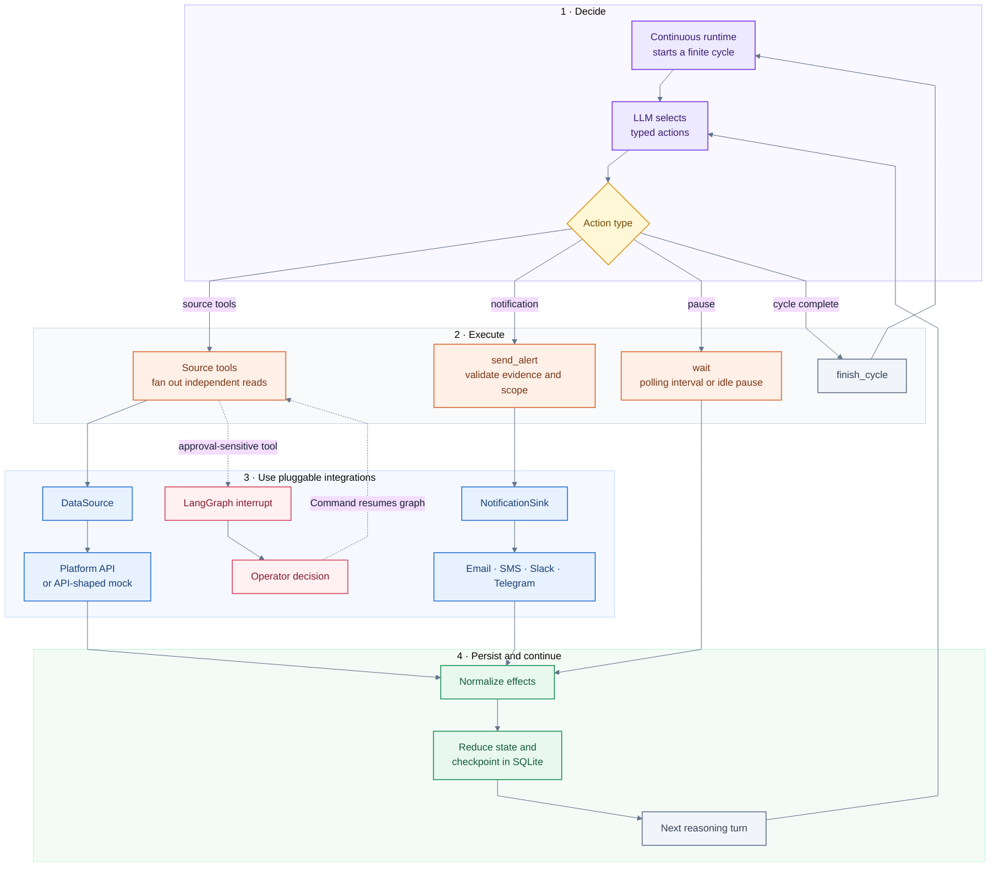

# EventPilot

EventPilot is a generic autonomous agent for operating on events and long-running work. It discovers
what is happening, chooses which tools to use, decides when to check again, takes source-defined
actions, and sends useful updates through a configured notification channel. It runs continuously
without requiring webhooks or an external scheduler.

A `DataSource` defines its domain by registering typed tools and translating their responses into
generic resource observations. These tools can inspect state or change it—for example, reading a
result, restarting a failed workflow, cancelling a job, submitting follow-up work, or updating an
incident.

This repository demonstrates that architecture against
[Adaptyv Foundry](https://foundry.adaptyvbio.com/). Foundry access is mocked, but its adapter follows
Adaptyv's published API. Fixture timing and lifecycle data stay hidden behind the adapter.

## What it does

- Discovers events and resources through tools supplied by the configured data source.
- Chooses and executes observational or state-changing tools as work evolves.
- Executes independent read tools concurrently and reduces their evidence in a stable order.
- Interleaves concurrent objectives instead of blocking on one resource.
- Chooses its own polling interval with a `wait` tool.
- Uses source evidence to decide whether to act, continue investigating, or notify an operator.
- Suspends consequential tools for explicit human approval, then executes or rejects the action.
- Delivers updates through a replaceable notification sink and records successful delivery.
- Persists progress, avoids duplicate work, and resumes across finite reasoning cycles.
- Enters a long idle wait when the source has no actionable work.

Instructor constrains every LLM response to a registered Pydantic tool model. LangGraph routes
tools, checkpoints state in SQLite, suspends approval-sensitive actions with `interrupt()`, and
resumes them with `Command`. Its reducers own objectives, polling, evidence, delivery state, and
cycle transitions. Platform details live behind a narrow `DataSource` protocol, while delivery lives
behind a separate `NotificationSink` protocol. A deployment can pair any source with any sink.

## Agent loop



Every completed tool path joins at one reducer before the next reasoning turn. Independent source
reads run as LangGraph `Send` branches and join in selection order. Approval-sensitive tools suspend
at `interrupt()` and resume from the same checkpoint with `Command`. `finish_cycle` closes the
finite cycle, then the continuous runtime starts a fresh one.

## Notification sinks

Notification sinks are pluggable delivery integrations. They let a deployment choose where updates
are sent without coupling a monitored platform to a messaging provider. The same data source can be
paired with Telegram, SMS, email, Slack, an incident-management system, or an internal service.

Every sink implements `NotificationSink.send()`, which accepts a destination and a provider-neutral
`Notification` containing a title, body, and priority. It returns a `DeliveryResult` with its channel
and provider message ID so delivery can be recorded durably.

The included `ConsoleNotificationSink` makes the repository runnable without another service. A
production deployment can implement the same small protocol for any delivery provider:

- A Telegram sink can send to a configured chat with the Bot API.
- An SMS sink can deliver through Twilio or another carrier gateway.
- An email or Slack sink can translate the same notification into its native message format.
- An internal sink can open an incident, publish to a queue, or call an operator platform.

When the agent finds an event worth reporting, it creates the notification from the available
evidence and sends it through the configured sink. Provider credentials and destinations remain
outside the LLM's tool arguments.

## Human approval

A data source can mark any consequential tool as approval-sensitive. The graph first delivers a
request through the configured notification sink and checkpoints the pending action. Its next node
calls LangGraph `interrupt()` with the action, resources, rationale, and delivery receipt.

An operator response resumes the same supervisor thread with `Command(resume=...)`. Approval routes
to the original source tool; rejection records a rejected tool result and returns control to the
agent. The SQLite checkpoint preserves the interruption across process restarts, and the delivery
node remains completed when the graph resumes, preventing a duplicate approval message.

## Adaptyv API mock

The demo does not require a Foundry account. `MockFoundryClient` implements the same
`FoundryClient` protocol used by the tool adapter and returns Pydantic models shaped around the
official endpoints:

- [List experiments](https://docs.adaptyvbio.com/api-reference/experiments/list-experiments)
- [Get an experiment](https://docs.adaptyvbio.com/api-reference/experiments/get-experiment)
- [List experiment updates](https://docs.adaptyvbio.com/api-reference/experiments/list-experiment-updates)
- [List results for an experiment](https://docs.adaptyvbio.com/api-reference/experiments/list-results-for-an-experiment)
- [Update an experiment](https://docs.adaptyvbio.com/api-reference/experiments/update-experiment)
- [Submit an experiment](https://docs.adaptyvbio.com/api-reference/experiments/submit-experiment)
- [Get an experiment quote](https://docs.adaptyvbio.com/api-reference/experiments/get-experiment-quote)
- [Accept an experiment quote](https://docs.adaptyvbio.com/api-reference/experiments/accept-an-experiments-quote-and-create-an-invoice)

See Adaptyv's [API introduction](https://docs.adaptyvbio.com/api-reference/api-introduction) for
authentication and the production API conventions.

The packaged fixture contains eight independent experiments with hidden lifecycle timing. One draft
starts below the source's replicate policy, so the agent can update and submit it. One experiment
has an open quote; the agent reads its USD amount and requests approval before accepting it and
creating an invoice. Draft and quoted lifecycles remain paused until their actions succeed.

The other lifecycle transitions follow elapsed clock time. Reads leave time unchanged, allowing the
agent to discover status changes, wait, inspect results, and act without a scripted event queue.

A production integration only needs a `FoundryClient` implementation that performs authenticated
HTTP requests. The graph consumes the same normalized effects from either client.

## Run the dashboard

The dashboard is an optional demonstration surface for observing the running agent and responding
to approval requests.

Copy the example configuration and add LLM credentials:

```bash
cp .env.example .env
```

```dotenv
LLM_PROVIDER=openai
LLM_MODEL=your-model
LLM_API_KEY=your-api-key
LLM_API_BASE=
```

Start the container:

```bash
docker compose up --build
```

Open [http://localhost:8000](http://localhost:8000). The dashboard shows the current decision,
rationale, typed arguments, experiment states, wait countdowns, delivered messages, pending
approvals, and the complete tool timeline. Approval controls submit a LangGraph resume command for
the suspended tool call. Dashboard events and LangGraph checkpoints persist in the Docker volume.

To start the same dashboard directly with uv:

```bash
uv sync
uv run eventpilot dashboard
```

Use **Reset demo** in the header to cancel the current run, delete the supervisor thread through the
LangGraph checkpointer, clear its event history, and start again. The container stays running.

## Time compression

Docker sets `EVENTPILOT_TIME_ACCELERATION=3600`. One logical second advances the mock experiment
clock by one hour. Active waits are capped at five physical seconds so a full experiment portfolio
can be shown in a short recording. After all experiments are reported, the idle wait runs for its
full duration so the dashboard visibly stops polling.

These settings control that behavior:

```dotenv
EVENTPILOT_TIME_ACCELERATION=3600
EVENTPILOT_MAX_PHYSICAL_WAIT_SECONDS=5
```

The model does not see the acceleration factor or fixture durations.

## Adding integrations

### Data sources

A source plugin provides:

- Pydantic tool models and descriptions exposed to Instructor.
- A client or command adapter that executes those tools.
- Source-owned state and validation for scope, evidence, deduplication, and waiting.

For example, a GitHub Actions source could expose workflow tools backed by `gh` without changing
the LangGraph runtime or dashboard.

### Notification sinks

A sink implements the provider-neutral delivery protocol:

```python
class NotificationSink(Protocol):
    channel_name: str

    async def send(
        self,
        destination: str,
        notification: Notification,
    ) -> DeliveryResult: ...
```

Register the implementation when constructing the autonomous agent. No graph, source adapter, or
prompt changes are required.

## Project layout

```text
src/eventpilot/
├── adapters/       # API models, client protocols, and mocks
├── core/           # Reasoning, graph runtime, clocks, and reporting
├── dashboard/      # Browser UI and durable event feed
├── notifications/  # Alert sinks
├── prompts/        # Source-neutral agent instructions
├── sources/        # Platform tools, state, and policy
└── cli.py           # Runtime entry points
```

## Development

```bash
make check
```

This checks the lockfile, Ruff, formatting, Pyright, tests with coverage, and package builds.
